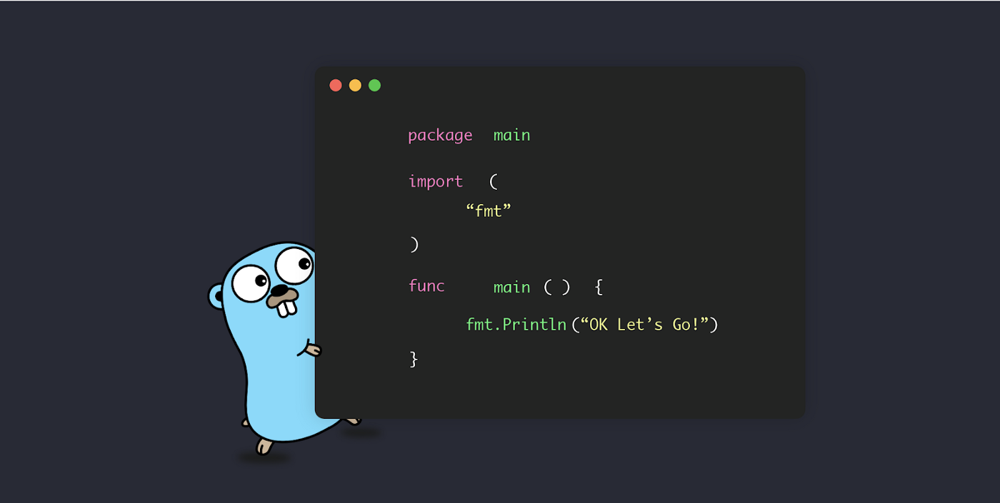

<h1 align="center">Formacao Go</h1>

## :dart: Courses

- [x] Fundamentos Go
- [x] Orientação a Objetos
- [x] Fundamentos de uma aplicação web
- [x] Desenvolvendo API Rest
- [x] Go e Gin - API rest com simplicidade
- [x] Validações, testes e páginas HTML

## 📚 Oficial documentation

- [Golang](https://go.dev/)
